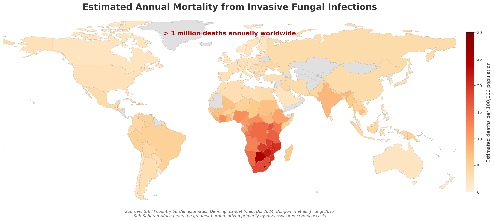
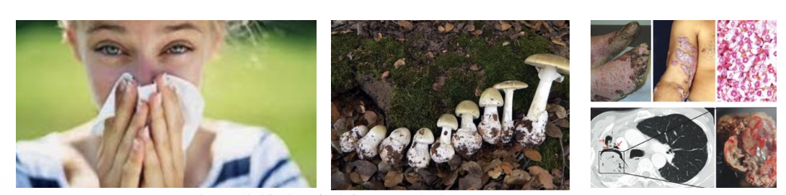
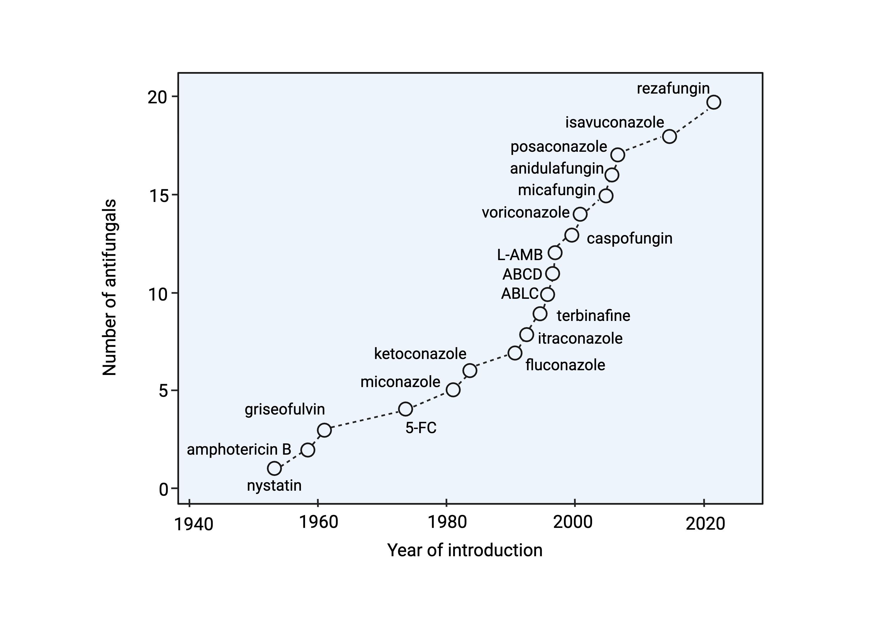
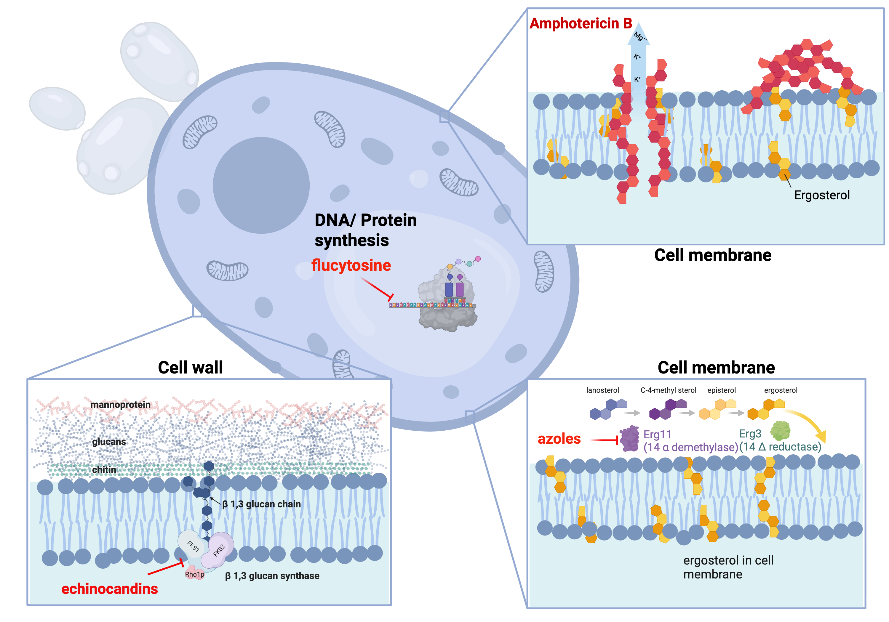
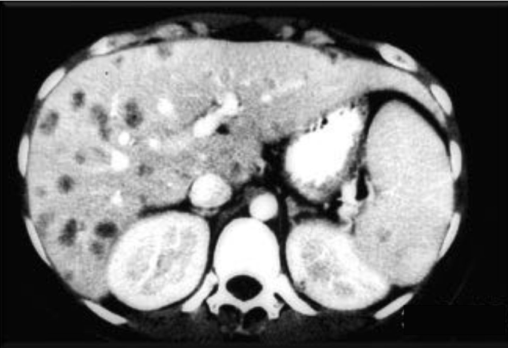
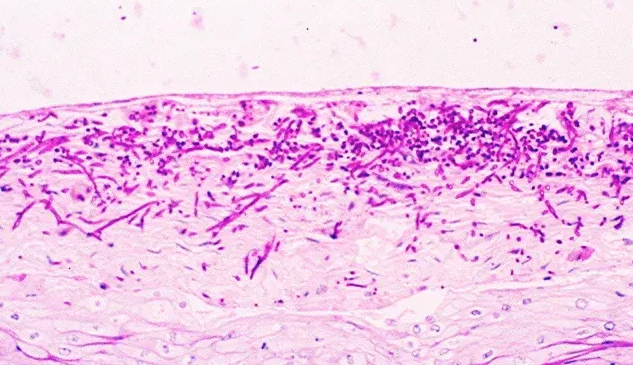
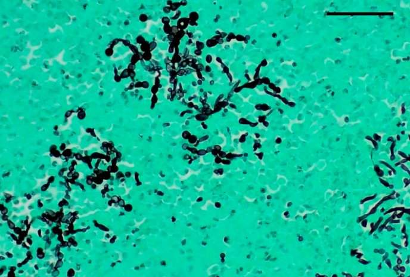
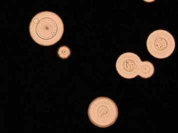
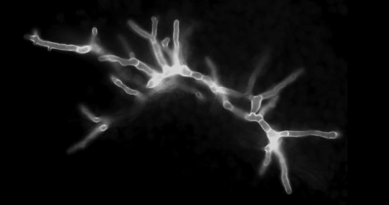
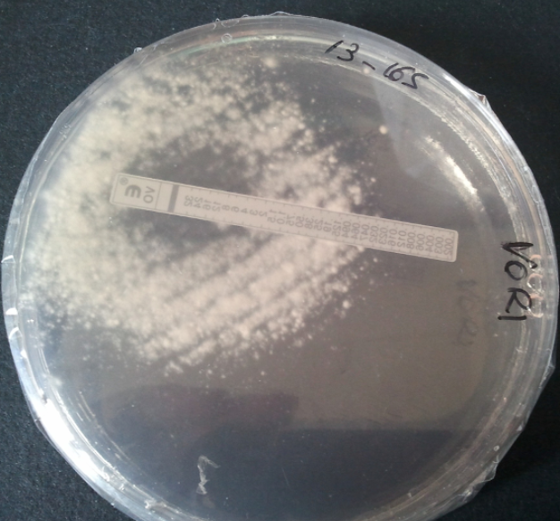

## Learning Objectives {.unnumbered}

Upon completion of this chapter, learners will be able to:

1. Describe the epidemiology and risk factors for invasive candidiasis, cryptococcosis, aspergillosis, and mucormycosis
2. Identify key clinical presentations and diagnostic approaches for each major invasive fungal infection
3. Select appropriate antifungal therapy based on patient factors, fungal species, and infection site
4. Recognize antifungal drug toxicities and their management
5. Apply evidence-based treatment guidelines to clinical scenarios

## Introduction to Invasive Fungal Infections

### The Global Burden of Fungal Disease

Invasive fungal infections (IFIs) represent a significant and growing threat to global health. While often overlooked compared to bacterial and viral pathogens, fungi cause substantial morbidity and mortality, particularly among immunocompromised populations [@brown2012].

::: {.callout-important}
## Key Statistics
- Over 1 million deaths annually from invasive fungal infections worldwide
- Fungal infections kill more people than malaria and are equivalent to tuberculosis deaths
- The burden is likely underestimated due to diagnostic challenges
:::

{fig-align="center" width="700"}

### Spectrum of Fungal Diseases

Fungal infections can be categorized by their anatomical involvement and host immune status:

| Type | Location | Examples | Primary Hosts |
|------|----------|----------|---------------|
| Superficial mycoses | Epidermis, hair, nails | Dermatophytosis, pityriasis | Immunocompetent |
| Subcutaneous mycoses | Dermis, subcutaneous tissue | Sporotrichosis, chromoblastomycosis | Immunocompetent (trauma) |
| Systemic mycoses from primary pathogens | Deep organs | Histoplasmosis, coccidioidomycosis | Immunocompetent & compromised |
| Systemic mycoses from opportunistic pathogens | Deep organs | Candidiasis, aspergillosis, cryptococcosis | Immunocompromised |

: Classification of Mycoses {#tbl-mycoses-classification}

{fig-align="center" width="700"}

### WHO Fungal Priority Pathogens List (2022)

The World Health Organization released its first fungal priority pathogens list in 2022, categorizing fungi by public health importance [@who2022]:

::: {.callout-note}
## WHO Priority Groups

**Critical Priority:**

- *Cryptococcus neoformans*
- *Candida auris*
- *Aspergillus fumigatus*
- *Candida albicans*

**High Priority:**

- *Nakaseomyces glabrata* (formerly *Candida glabrata*)
- *Histoplasma* spp.
- Eumycetoma causative agents
- Mucorales
- *Fusarium* spp.
- *Candida tropicalis*
- *Candida parapsilosis*

**Medium Priority:**

- *Scedosporium* spp.
- *Lomentospora prolificans*
- *Coccidioides* spp.
- *Pichia kudriavzevii* (formerly *Candida krusei*)
- *Cryptococcus gattii*
- *Talaromyces marneffei*
- *Pneumocystis jirovecii*
- *Paracoccidioides* spp.
:::

## Antifungal Therapies

### Evolution of Antifungal Development

The development of systemic antifungal agents has progressed significantly since the introduction of amphotericin B in 1958:

| Era | Year(s) | Agents | Target |
|-----|---------|--------|--------|
| Early | 1958 | Amphotericin B deoxycholate | Ergosterol binding |
| Azole development | 1981-1992 | Ketoconazole, fluconazole, itraconazole | Lanosterol 14-α-demethylase |
| Lipid formulations | 1990s | L-AMB, ABLC, ABCD | Ergosterol (reduced toxicity) |
| Expanded-spectrum azoles | 2002-2015 | Voriconazole, posaconazole, isavuconazole | Lanosterol 14-α-demethylase |
| Echinocandins | 2001-2006 | Caspofungin, micafungin, anidulafungin | β-1,3-glucan synthase |
| Novel agents | 2023+ | Ibrexafungerp, rezafungin, olorofim | Various new targets |

: Timeline of Antifungal Development {#tbl-antifungal-timeline}

{fig-align="center" width="700"}

### Mechanisms of Action

Antifungal agents target distinct components of the fungal cell:

**Cell Membrane Targets:**

- **Polyenes** (amphotericin B): Bind ergosterol, creating pores that lead to cell death
- **Azoles**: Inhibit lanosterol 14-α-demethylase (CYP51), disrupting ergosterol synthesis

**Cell Wall Targets:**

- **Echinocandins**: Inhibit β-1,3-glucan synthase, disrupting cell wall integrity

{fig-align="center" width="700"}

### Antifungal Spectrum of Activity

The spectrum of activity varies significantly across drug classes. Selecting the appropriate agent requires matching the likely or confirmed pathogen against coverage gaps:

| Agent | *Candida* | *Aspergillus* | *Cryptococcus* | Mucorales |
|-------|-----------|---------------|----------------|-----------|
| Fluconazole | ++ | − | ++ | − |
| Voriconazole | +++ | +++ | + | − |
| Posaconazole | +++ | +++ | + | ++ |
| Isavuconazole | +++ | +++ | + | ++ |
| Echinocandins | +++ | ++ | − | − |
| Amphotericin B | +++ | ++ | +++ | +++ |

: Antifungal Spectrum of Activity {#tbl-antifungal-spectrum}

::: {.callout-tip}
## Clinical Pearl
The spectrum of antifungal activity varies significantly between drug classes:

- **Fluconazole**: Most *Candida* spp. (not *C. krusei*, reduced activity vs *C. glabrata*); no mold activity
- **Voriconazole/Isavuconazole/Posaconazole**: Broad *Candida* coverage + *Aspergillus*; posaconazole and isavuconazole have Mucorales activity
- **Echinocandins**: *Candida* spp. (including *C. glabrata*) + *Aspergillus*; no *Cryptococcus* or Mucorales activity
- **Amphotericin B**: Broadest spectrum - most yeasts and molds including Mucorales
:::

### Antifungal Tissue Distribution {#sec-tissue-distribution}

Understanding antifungal tissue penetration is critical for selecting appropriate therapy [@felton2014]:

| Drug | CSF | Eye/Vitreous | Urine | Lung ELF |
|------|-----|--------------|-------|----------|
| Fluconazole | +++ | +++ | +++ | ++ |
| Voriconazole | ++ | ++ | + | +++ |
| Posaconazole | + | + | - | +++ |
| Isavuconazole | + | + | - | +++ |
| Amphotericin B | +/- | +/- | + | ++ |
| Echinocandins | - | - | - | + |

: Antifungal Tissue Penetration {#tbl-tissue-penetration}

::: {.callout-warning}
## Important Consideration
Echinocandins have poor CNS, eye, and urine penetration. They should not be used as monotherapy for infections at these sites.
:::

## Invasive Candidiasis {#sec-candidiasis}

### Epidemiology

Invasive candidiasis is the most common invasive fungal infection in hospitalized patients. The epidemiology has evolved significantly over recent decades [@pappas2018]:

**Species Distribution:**

- *Candida albicans*: 40-60% (decreasing)
- *Candida glabrata*: 15-25% (increasing, especially with azole exposure)
- *Candida parapsilosis*: 10-20% (associated with central lines, TPN)
- *Candida tropicalis*: 5-10% (more common in neutropenic patients)
- *Candida krusei*: 2-5% (intrinsically fluconazole-resistant)
- *Candida auris*: Emerging multidrug-resistant threat

### Risk Factors

::: {.callout-note}
## Major Risk Factors for Invasive Candidiasis

**Host Factors:**

- Neutropenia
- Diabetes mellitus
- Extremes of age
- Recent surgery (especially abdominal)
- Burns

**Healthcare Exposures:**

- Central venous catheters
- Total parenteral nutrition
- Broad-spectrum antibiotics
- ICU admission >3 days
- Prior colonization with *Candida*

**Medications:**

- Corticosteroids
- Immunosuppressive agents
- Prior antifungal exposure
:::

### Pathogenesis

*Candida* species are commensal organisms of the human gastrointestinal tract, skin, and mucous membranes. Invasive disease occurs when host defenses are compromised or mucosal barriers are breached.

**Key Pathogenic Steps:**

1. Colonization of mucosal surfaces
2. Breach of mucosal barrier (surgery, mucositis, catheters)
3. Bloodstream invasion
4. Dissemination to deep organs
5. Biofilm formation (especially on devices)

{fig-align="center" width="600"}

![Continuum of invasive candidiasis, from superficial colonization through candidemia to deep-seated organ involvement. [@pappas2018]](images/continuum.png){fig-align="center" width="700"}

### Clinical Presentations

**Candidemia:**

- Fever unresponsive to antibiotics
- Often no localizing signs
- May have metastatic complications (endophthalmitis, osteomyelitis, endocarditis)

**Deep-seated Candidiasis:**

- Hepatosplenic candidiasis (chronic disseminated): Fever, elevated alkaline phosphatase, target lesions on imaging
- Candida peritonitis: Abdominal surgery, peritoneal dialysis
- Candida endocarditis: Prosthetic valves, IV drug use

{fig-align="center" width="600"}

### Diagnosis {#sec-candida-diagnosis}

::: {.callout-important}
## The "Missing 50%"
Blood cultures detect only approximately 50% of invasive candidiasis cases, highlighting the need for adjunctive diagnostic methods [@clancy2013].
:::

**Culture-Based Methods:**

- Blood cultures: Gold standard but limited sensitivity
- Tissue cultures: Higher yield but require invasive sampling

**Non-Culture Diagnostics:**

| Test | Sensitivity | Specificity | Comments |
|------|-------------|-------------|----------|
| β-D-glucan | 75-80% | 80% | Pan-fungal; false positives with dialysis, gauze, some antibiotics |
| T2Candida Panel | 91% | 99% | Direct from blood; rapid results; detects 5 common species |
| Candida PCR | 85-95% | 90-95% | Not widely standardized |

: Non-Culture Diagnostics for Invasive Candidiasis {#tbl-candida-diagnostics}

**Histopathology:**

Tissue diagnosis of invasive candidiasis relies on special stains to highlight fungal elements in tissue specimens:

| Stain | Appearance |
|-------|-----------|
| PAS (Periodic Acid–Schiff) | Magenta yeast and pseudohyphae |
| GMS (Gomori Methenamine Silver) | Black yeast and hyphae against green background |

{width="45%"} {width="45%"}

### Treatment {#sec-candida-treatment}

#### Initial Therapy

Treatment selection depends on patient stability, prior azole exposure, and suspected species [@pappas2016]:

```{mermaid}
%%| label: fig-candida-algorithm
%%| fig-cap: "Treatment Algorithm for Candidemia"
flowchart TD
    A[Candidemia Suspected/Confirmed] --> B{Patient Status}
    B -->|Hemodynamically Stable| C{Prior Azole Exposure?}
    B -->|Unstable/Severe| D[Echinocandin]
    C -->|No| E[Fluconazole 800mg load, then 400mg daily]
    C -->|Yes| D
    D --> F{Species Identification}
    F -->|C. glabrata| G[Continue Echinocandin]
    F -->|C. krusei| G
    F -->|C. parapsilosis| H[Consider Fluconazole]
    F -->|Other susceptible| I[Step-down to Fluconazole if stable]
```

#### Source Control

::: {.callout-warning}
## Critical Intervention
Central venous catheter removal is associated with improved outcomes and should be performed whenever feasible in patients with candidemia.
:::

#### Duration of Therapy

- **Uncomplicated candidemia**: 14 days after first negative blood culture and resolution of symptoms
- **Deep-seated infection**: Extended duration based on site (e.g., endocarditis: 6 weeks post-valve surgery)

#### Ophthalmologic Examination

All patients with candidemia should receive a dilated funduscopic examination to evaluate for endophthalmitis:

- **Timing**: Within 1 week of diagnosis (after neutrophil recovery in neutropenic patients)
- **Finding**: Chorioretinal lesions with or without vitritis
- **Management**: Extended antifungal therapy; ophthalmology consultation

{fig-align="center" width="500"}

### Antifungal Susceptibility Testing

Susceptibility testing is recommended for all bloodstream isolates. CLSI and EUCAST breakpoints guide interpretation:

| Species | Fluconazole | Echinocandins | Comments |
|---------|-------------|---------------|----------|
| *C. albicans* | S ≤2 | S ≤0.25 | Usually susceptible |
| *C. glabrata* | SDD ≤32 | S ≤0.12 | Dose-dependent; check echinocandin susceptibility |
| *C. krusei* | R (intrinsic) | S ≤0.25 | Use echinocandin or amphotericin B |
| *C. parapsilosis* | S ≤2 | Higher MICs (S ≤2) | Fluconazole often preferred |
| *C. auris* | Often R | Variable | Requires individualized testing |

: CLSI Breakpoints for Candida Species (mg/L) {#tbl-candida-breakpoints}

## Cryptococcosis {#sec-cryptococcosis}

### Epidemiology

Cryptococcosis is caused by encapsulated yeasts of the *Cryptococcus* species complex. It remains a leading cause of mortality in HIV-infected individuals, particularly in resource-limited settings [@park2009; @tugume2023].

**Global Burden:**

- Approximately 220,000 cases of cryptococcal meningitis annually
- 180,000 deaths per year
- Most cases occur in sub-Saharan Africa
- Leading cause of meningitis in adults with HIV in Africa

{fig-align="center" width="600"}

### Species and Ecology

| Species | Primary Host | Geographic Distribution | Clinical Association |
|---------|--------------|------------------------|---------------------|
| *C. neoformans* | Immunocompromised (HIV, transplant) | Worldwide | Soil, bird droppings |
| *C. gattii* | Immunocompetent & immunocompromised | Pacific Northwest, Australia, tropics | Eucalyptus trees |

: Cryptococcus Species Characteristics {#tbl-crypto-species}

### Pathogenesis

*Cryptococcus* has several virulence factors that enable evasion of host defenses:

1. **Polysaccharide capsule**: Antiphagocytic; immunomodulatory
2. **Melanin production**: Antioxidant protection
3. **Ability to survive within macrophages**: Trojan horse mechanism for CNS penetration
4. **Titan cells**: Large cells resistant to phagocytosis

{fig-align="center" width="400"}

### Clinical Manifestations

**Cryptococcal Meningitis:**

- Subacute presentation over 1-2 weeks
- Headache (most common)
- Fever
- Altered mental status
- Neck stiffness (less common than bacterial meningitis)
- Cranial nerve palsies
- Visual disturbances

::: {.callout-important}
## Elevated Intracranial Pressure
Elevated intracranial pressure (ICP) is a major cause of morbidity and mortality in cryptococcal meningitis. Opening pressure >25 cm H₂O is associated with poor outcomes.
:::

**Pulmonary Cryptococcosis:**

- May be asymptomatic (incidental finding)
- Cough, dyspnea, chest pain
- Nodules or infiltrates on imaging

**Disseminated Disease:**

- Skin lesions (umbilicated papules resembling molluscum)
- Bone involvement
- Prostate (sanctuary site)

{fig-align="center" width="500"}

### Diagnosis

**Lumbar Puncture Findings:**

| Parameter | Typical Finding |
|-----------|----------------|
| Opening pressure | Elevated (often >25 cm H₂O) |
| WBC | Elevated (lymphocyte predominant); may be low in severe immunosuppression |
| Glucose | Low |
| Protein | Elevated |
| CrAg (LFA) | Positive |
| India ink | Positive in ~75–85% of cases |

: CSF Findings in Cryptococcal Meningitis {#tbl-csf-crypto}

::: {.callout-important}
## Elevated Opening Pressure
Opening pressure must always be measured and documented. Severely immunosuppressed patients may have a paradoxically low WBC despite high fungal burden — this portends a worse prognosis. ICP management is often more critical than antifungal drug choice in the first days of treatment.
:::

**Diagnostic Tests:**

| Test | Sensitivity | Specificity | Comments |
|------|-------------|-------------|----------|
| CSF CrAg (lateral flow) | 99% | 99% | Rapid, point-of-care |
| Serum CrAg | 99% | 99% | Can be positive before symptoms |
| CSF India ink | 75-85% | >95% | Visualizes capsule; less sensitive |
| CSF culture | 95% | 100% | Gold standard; takes 3-7 days |

: Diagnostic Tests for Cryptococcosis {#tbl-crypto-diagnostics}

::: {.callout-tip}
## Screening Recommendation
Serum cryptococcal antigen (CrAg) screening is recommended for HIV-infected individuals with CD4 <100 cells/μL to identify subclinical disease before symptom onset.
:::

{fig-align="center" width="500"}

### Treatment

#### The AMBITION Trial

The AMBITION trial established single high-dose liposomal amphotericin B as the preferred induction regimen [@jarvis2022]:

**Key Findings:**

- Single dose L-AMB (10 mg/kg) + 14 days flucytosine + fluconazole was non-inferior to 7-day amphotericin B deoxycholate regimens
- 10-week mortality: 24.8% vs 28.7% (difference -3.9%, 95% CI -10.4 to 2.6)
- Fewer adverse events with single-dose regimen
- Simplified administration

#### Treatment Regimens

|  | **Induction** (2 weeks) | **Consolidation** (8 weeks) | **Maintenance** |
|--|-------------------------|----------------------------|-----------------|
| **Preferred** | L-AMB 10 mg/kg × 1 dose + flucytosine 100 mg/kg/day × 14 days + fluconazole 1200 mg/day × 14 days | Fluconazole 800 mg/day | Fluconazole 200 mg/day |
| **Alternative** | AmB deoxycholate 1 mg/kg/day × 7 days + flucytosine × 7 days | — | — |
| **Discontinue** | — | — | CD4 >100 cells/μL for ≥3 months on ART |

: Cryptococcal Meningitis Treatment Phases {#tbl-crypto-treatment}

**Induction (2 weeks):**

1. **Preferred**: Single dose liposomal amphotericin B (10 mg/kg) + flucytosine (100 mg/kg/day) + fluconazole (1200 mg/day)
2. **Alternative**: Amphotericin B deoxycholate (1 mg/kg/day) + flucytosine (100 mg/kg/day) × 7 days

**Consolidation (8 weeks):**

- Fluconazole 800 mg/day

**Maintenance:**

- Fluconazole 200 mg/day until immune reconstitution (CD4 >100 for 3 months on ART)

#### Management of Elevated ICP

::: {.callout-warning}
## Critical Intervention
Aggressive management of elevated intracranial pressure is essential for survival. Therapeutic lumbar punctures should be performed to reduce opening pressure by 50% or to <20 cm H₂O.
:::

**Approach:**

1. Daily lumbar punctures initially if opening pressure >25 cm H₂O
2. Remove sufficient CSF to reduce pressure by 50% or to normal
3. Consider lumbar drain or VP shunt for refractory cases
4. Avoid corticosteroids (associated with worse outcomes)
5. Acetazolamide and mannitol are not effective

### Prognosis

Factors associated with poor outcome [@williamson2017]:

- High CSF fungal burden
- Altered mental status at presentation
- Elevated opening pressure
- Low CSF white cell count
- Underlying malignancy
- Inadequate ICP management

## Invasive Aspergillosis {#sec-aspergillosis}

### Spectrum of Aspergillus Diseases

The clinical manifestations of *Aspergillus* infection depend on host immune status:

{fig-align="center" width="600"}

**Immunocompromised Hosts (Immune Dysfunction):**

- Acute invasive aspergillosis
- Subacute invasive aspergillosis

**Normal Immune Function (Middle of Spectrum):**

- Tracheobronchitis
- Aspergilloma
- Chronic cavitary aspergillosis
- Chronic fibrosing aspergillosis

**Immune Hyperactivity:**

- Allergic bronchopulmonary aspergillosis (ABPA)
- Allergic fungal sinusitis

### Aspergillus Species

| Species | Frequency | Clinical Significance |
|---------|-----------|----------------------|
| *A. fumigatus* | 70-80% | Most common cause of IA |
| *A. flavus* | 10-15% | More common in sinusitis; produces aflatoxins |
| *A. niger* | 5-10% | Otomycosis; may produce aspergillomas |
| *A. terreus* | 2-5% | Intrinsically amphotericin B resistant |
| *A. nidulans* | Rare | Associated with chronic granulomatous disease |

: Common Aspergillus Species {#tbl-aspergillus-species}

### Mode of Acquisition

*Aspergillus* conidia (2-3 μm) are ubiquitous in the environment and inhaled daily. In immunocompetent hosts, conidia are cleared by:

1. Mucociliary clearance
2. Alveolar macrophage phagocytosis
3. Neutrophil killing of germinating hyphae

### Risk Factors

::: {.callout-note}
## Major Risk Factors for Invasive Aspergillosis

**Host Factors:**

- Severe and prolonged neutropenia (≥3 weeks)
- Hematopoietic stem cell transplant (especially allogeneic)
- Solid organ transplant (especially lung)
- Chronic granulomatous disease
- Advanced AIDS

**Iatrogenic:**

- High-dose corticosteroids (≥0.5 mg/kg/day prednisone equivalent)
- Ibrutinib and other BTK inhibitors
- T-cell depleting therapies

**Emerging Risk Groups:**

- COPD with corticosteroid therapy
- ICU patients (especially with influenza or COVID-19)
- Liver cirrhosis
:::

### Pathogenesis

#### Bronchial-Alveolar Phase

Initial invasion occurs through bronchial and alveolar walls:

- Conidia germinate in airways
- Hyphae invade bronchial/alveolar epithelium
- Associated inflammation
- CT findings: Centrilobular nodules, tree-in-bud pattern
- Low fungal burden; serum galactomannan often negative
- BAL galactomannan/culture may be positive

#### Angioinvasive Phase

In severely immunocompromised patients, disease progresses to angioinvasion:

**Progression Timeline:**

| Day | Pathology | CT Finding | Biomarkers |
|-----|-----------|------------|------------|
| 0-3 | Hyphal tissue invasion | Macronodule ± halo sign | GM may be negative |
| 5-7 | Hemorrhage, infarction | Dense consolidation | Serum GM positive |
| 10-12 | Extensive necrosis | Hypodense sign | High fungal burden |
| 15-18 | Neutrophil recovery, cavitation | Air-crescent sign | May persist |

: Temporal Progression of Angioinvasive Aspergillosis {#tbl-ia-progression}

{fig-align="center" width="700"}

### Clinical Presentation

**Pulmonary Aspergillosis:**

- Fever unresponsive to antibiotics
- Pleuritic chest pain
- Cough, hemoptysis
- Dyspnea

**Sinus Aspergillosis:**

- Facial pain
- Nasal congestion/discharge
- Periorbital swelling
- Black eschar on nasal examination

**Disseminated Aspergillosis:**

- CNS involvement (ring-enhancing lesions, abscesses)
- Cutaneous lesions
- Multiple organ involvement

### Diagnosis

#### Imaging

**CT Findings Suggestive of IPA:**

- Nodules with halo sign (ground-glass surrounding dense core)
- Air-crescent sign (late finding with neutrophil recovery)
- Wedge-shaped infiltrates
- Cavitation

::: {.callout-tip}
## Halo Sign
The halo sign (ground-glass attenuation surrounding a nodule) is relatively specific for angioinvasive mold infection in neutropenic patients, particularly in the first week of infection.
:::

{fig-align="center" width="450"}

**CT Pulmonary Angiography (Vessel Occlusion Sign):**

- Can help differentiate IPA from other pulmonary processes
- Positive VOS shows vessel truncation within or adjacent to nodules

#### Laboratory Diagnosis

**Culture and Histopathology:**

- BAL culture: Sensitivity 50-60%
- Tissue biopsy: Septate hyphae with acute-angle (45°) branching
- PAS and GMS stains highlight fungal elements

{width="45%"} {width="45%"}

**Galactomannan Testing:**

| Sample | Cutoff | Sensitivity | Specificity | Notes |
|--------|--------|-------------|-------------|-------|
| Serum | ≥0.5 ODI | 70-80% | 85-90% | Better in neutropenic patients |
| BAL | ≥1.0 ODI | 85-90% | 90-95% | Higher sensitivity than serum |

: Galactomannan Testing Performance {#tbl-gm-testing}

::: {.callout-warning}
## False Positives
Galactomannan false positives can occur with:

- Piperacillin-tazobactam (older formulations)
- Mucositis
- Certain foods
- Cross-reactivity with other fungi (*Fusarium*, *Histoplasma*)
:::

**Other Biomarkers:**

- **β-D-glucan**: Less specific (pan-fungal); may be useful in combination
- **Aspergillus PCR**: High sensitivity; not yet standardized

### Treatment

#### First-Line Therapy

Triazoles with mold activity are preferred for primary therapy [@thompson2021nejm]:

**If NO Prior Mold-Active Prophylaxis:**

- Voriconazole (loading: 6 mg/kg IV q12h × 2 doses; maintenance: 4 mg/kg IV q12h or 200-300 mg PO q12h)
- Isavuconazole (loading: 200 mg q8h × 6 doses; maintenance: 200 mg daily)
- Posaconazole (300 mg IV/PO q12h × 2 doses, then 300 mg daily)

**If Receiving Posaconazole Prophylaxis:**

- Liposomal amphotericin B (3-5 mg/kg/day) initially
- Reassess triazole failure: drug levels, resistance, alternative diagnosis
- Consider switching to alternative triazole if isolate is susceptible and patient stabilizes

#### Antifungal Resistance

Triazole resistance in *Aspergillus fumigatus* is an emerging concern:

{fig-align="center" width="500"}

::: {.callout-important}
## Azole Resistance
Environmental azole resistance (TR34/L98H and TR46/Y121F/T289A mutations) is increasing globally due to agricultural fungicide use. Rates vary by region:

- Netherlands: 5-15%
- UK: 5-10%
- Germany: 3-5%
- United States: 1-3%
- Some Asian regions: Up to 30%

Consider resistance testing in refractory cases or high-prevalence regions.
:::

#### Duration

- **Minimum**: 6-12 weeks
- **Continue until**: Resolution of all lesions, reversal of immunosuppression
- **Secondary prophylaxis**: Consider during subsequent immunosuppression

### Prognosis

Key prognostic factors:

- Early diagnosis and prompt antifungal therapy
- Recovery from neutropenia/immune suppression
- Underlying disease status
- Site of infection (CNS involvement = worse prognosis)
- Triazole resistance

## Other Mold Infections

### Fusariosis

*Fusarium* species are emerging pathogens causing severe infections in neutropenic patients.

**Key Features:**

- Most common scenario: Persistent neutropenia
- Common species: *F. solani* complex (50%), *F. oxysporum* (14%), *F. verticillioides* (10-11%)
- Characteristic finding: Metastatic skin lesions
- **Positive blood cultures in 30-50% of cases** (unlike other mold infections)
- Macroconidia are classic (banana-shaped)

{fig-align="center" width="600"}

{fig-align="center" width="600"}

**Treatment:**

- High-dose liposomal amphotericin B ± voriconazole
- Neutrophil recovery is critical
- G-CSF may be beneficial

::: {.callout-note}
## Fusarium Outbreak
A multinational outbreak (185 exposed, 9 cases) of nosocomial *Fusarium solani* meningitis occurred among immunocompetent patients who underwent surgery with epidural anesthesia in Mexico in 2023 [@strong2024]. The pathogen showed high predilection for the brainstem and vertebrobasilar arterial system, with high mortality from vessel injury.
:::

![Epidemiological map of the 2023 multinational nosocomial *Fusarium solani* meningitis outbreak, linked to contaminated surgical/anesthesia equipment. This outbreak highlights the risk of invasive fungal infections in immunocompetent patients following breaches in sterile technique. [@strong2024]](images/fusarium_outbreak.png){fig-align="center" width="500"}

### Mucormycosis {#sec-mucormycosis}

#### Epidemiology and Risk Factors

Mucormycosis is caused by fungi of the order Mucorales, including *Rhizopus*, *Mucor*, *Lichtheimia*, and others.

{fig-align="center" width="600"}

**Risk Factors:**

- Uncontrolled diabetes mellitus (especially ketoacidosis)
- Hematologic malignancy with neutropenia
- Hematopoietic stem cell transplant
- Solid organ transplant
- Iron overload states
- Deferoxamine therapy (acts as a siderophore)
- Trauma, burns
- COVID-19 (especially in India, 2021 outbreak)

#### Common Species

| Genus | Clinical Significance |
|-------|----------------------|
| *Rhizopus* spp. | Most common (especially *R. arrhizus*) |
| *Mucor* spp. | Less common but significant |
| *Lichtheimia* spp. | Common in immunocompromised |
| *Rhizomucor* spp. | More aggressive disease |
| *Cunninghamella* spp. | Disseminated disease; very poor prognosis |
| *Apophysomyces* spp. | Cutaneous/soft tissue (trauma) |

: Common Mucorales Species {#tbl-mucorales-species}

#### Pathogenesis

Mucorales have a unique relationship with iron:

1. Spores inhaled, deposited in nasal turbinates or alveoli
2. Macrophages attempt phagocytosis (impaired by glucocorticoids)
3. Neutrophils damage hyphal forms; iron acquisition supports proliferation
4. **Angioinvasion** leads to thrombosis, hemorrhage, and tissue necrosis
5. Hyperglycemia, acidosis, and free iron facilitate growth

{fig-align="center" width="650"}

::: {.callout-warning}
## Deferoxamine Risk
Iron chelation with deferoxamine increases mucormycosis risk (fungus uses it as a xenosiderophore). Newer chelating agents like deferasirox do not carry this risk.
:::

#### Clinical Manifestations

**Rhinocerebral Mucormycosis:**

- Most common form in diabetic patients
- Begins with sinusitis, facial pain
- Rapid progression with necrotic eschar (black eschar = late finding)
- Orbital involvement: Proptosis, vision loss
- Cavernous sinus thrombosis
- CNS extension: High mortality

{fig-align="center" width="500"}

**Pulmonary Mucormycosis:**

- More common in neutropenic patients
- Nodular infiltrates
- Reverse halo sign
- Pleural effusions
- Rapid progression

**Cutaneous Mucormycosis:**

- Trauma, burns, surgical wounds
- Natural disasters (e.g., Joplin tornado)
- Combat injuries
- Necrotizing soft tissue infection

#### Diagnosis

::: {.callout-important}
## Diagnostic Limitations
Serum β-D-glucan and galactomannan do NOT detect Mucorales. These tests being negative does not exclude mucormycosis.
:::

**Diagnostic Approach:**

- Histopathology: Wide (6-16 μm), ribbon-like, pauciseptate hyphae with right-angle branching
- Culture: Rapid growth ("lid lifter"); confirm species identification
- PCR/sequencing: Available in some centers
- MALDI-TOF: For isolate identification

**Imaging:**

- MRI: "Black turbinate sign" (devitalized tissue in sinuses)
- CT: Reverse halo sign in pulmonary disease

{fig-align="center" width="600"}

{fig-align="center" width="500"}

#### Treatment

**Principles:**

1. **Surgical debridement**: Essential; often requires multiple operations
2. **Reversal of predisposing conditions**: Glucose control, reduce immunosuppression
3. **Antifungal therapy**: Start immediately

{fig-align="center" width="600"}

**Antifungal Regimen:**

- **Initial**: Liposomal amphotericin B 5-10 mg/kg/day
- **Step-down**: Posaconazole or isavuconazole (for patients responding or with toxicity)
- **Duration**: Prolonged; minimum until clinical/radiographic resolution

::: {.callout-tip}
## Treatment Pearls
- Higher doses of L-AMB (10 mg/kg/day) may be considered for CNS involvement
- Combination therapy (L-AMB + posaconazole/isavuconazole) is sometimes used but not proven superior
- Surgical debridement should not be delayed for imaging; early aggressive surgery improves outcomes
:::

#### Prognosis

Mucormycosis carries significant morbidity and mortality:

- Overall mortality: 40-80% depending on form and host
- Rhinocerebral with CNS extension: >80% mortality
- Disseminated disease: >90% mortality
- Factors improving survival: Early diagnosis, surgical debridement, immune recovery

::: {.callout-note}
## Healthcare Professional Survey
In a Twitter poll of 1,885 infectious disease specialists, 44% rated mucormycosis as the "scariest" infectious disease, more than *Candida auris* (18%), *Staphylococcus aureus* (24%), or SARS-CoV-2 (14%).
:::

## Antifungal Toxicities {#sec-toxicities}

### Amphotericin B Toxicities

#### Nephrotoxicity

Amphotericin B deoxycholate causes significant nephrotoxicity through multiple mechanisms:

1. **Afferent arteriole constriction**: Reduced renal blood flow
2. **Tubuloglomerular feedback**: Further vasoconstriction
3. **Direct tubular toxicity**: LDL-bound AMB accumulates via LDL receptors
4. **Electrolyte wasting**: K⁺, Mg²⁺, Na⁺ loss

{fig-align="center" width="600"}

**Clinical Impact:**

- ≥2-fold increase in serum creatinine in 26% of patients receiving AMB deoxycholate
- Severe electrolyte abnormalities common

#### Liposomal Formulation Advantages

Liposomal amphotericin B reduces nephrotoxicity:

- Liposomes do not undergo glomerular filtration
- Reduced binding to LDL receptors
- ≥2-fold SCr increase in only 10% of patients
- Allows higher dosing when needed

#### Infusion-Related Reactions

- Fever, rigors, chills
- Hypotension
- More common with deoxycholate formulation
- Premedication with acetaminophen, diphenhydramine may help

### Triazole Toxicities

| Toxicity | Most Commonly Associated Agent(s) |
|----------|----------------------------------|
| Hepatotoxicity | All azoles (highest with voriconazole) |
| QTc prolongation | All azoles (less with isavuconazole) |
| Visual disturbances (photopsia) | Voriconazole |
| Phototoxicity/skin cancer | Voriconazole (long-term) |
| CNS effects (hallucinations) | Voriconazole |
| Peripheral neuropathy | Itraconazole > voriconazole > others |
| GI intolerance | Itraconazole, posaconazole |
| Cardiomyopathy | Itraconazole |
| Periostitis (bone pain) | Voriconazole (fluoride toxicity) |
| Adrenal suppression | Itraconazole, posaconazole |

: Triazole-Specific Toxicities {#tbl-azole-toxicity}

::: {.callout-tip}
## Monitoring Recommendations
- Liver function tests at baseline and periodically during therapy
- Trough drug levels for voriconazole (target 1-5 μg/mL), posaconazole (>1 μg/mL), and isavuconazole (if concerns about efficacy/toxicity)
- ECG at baseline if risk factors for QTc prolongation
- Visual symptoms inquiry for voriconazole patients
:::

## Summary and Key Points

::: {.callout-important}
## Take-Home Messages

**Invasive Candidiasis:**

- Blood cultures miss 50% of cases; use adjunctive diagnostics
- Source control (catheter removal) improves outcomes
- Echinocandins are first-line for unstable patients
- Dilated eye exam for all patients with candidemia

**Cryptococcosis:**

- CrAg screening for HIV patients with CD4 <100
- Single high-dose L-AMB (AMBITION regimen) is preferred
- Aggressive ICP management is critical
- Avoid corticosteroids

**Invasive Aspergillosis:**

- Early CT and galactomannan testing in high-risk patients
- Voriconazole, isavuconazole, or posaconazole for primary therapy
- Use L-AMB if breakthrough on azole prophylaxis
- Monitor for azole resistance

**Mucormycosis:**

- β-D-glucan and galactomannan do NOT detect Mucorales
- Surgical debridement is essential
- High-dose liposomal amphotericin B (5-10 mg/kg/day)
- Control underlying conditions (diabetes, immunosuppression)
:::

## Appendix: Quick Reference Tables {.unnumbered}

### Antifungal Dosing Reference {.unnumbered}

| Drug | Loading Dose | Maintenance Dose | Notes |
|------|-------------|-----------------|-------|
| Fluconazole | 800 mg | 400 mg daily | Dose-adjust for renal impairment |
| Voriconazole | 6 mg/kg IV q12h × 2 | 4 mg/kg IV q12h or 200–300 mg PO q12h | TDM target: 1–5 μg/mL; avoid IV in renal impairment (cyclodextrin) |
| Posaconazole DR | 300 mg q12h × 2 | 300 mg daily | Tablet preferred over suspension (better bioavailability) |
| Isavuconazole | 200 mg q8h × 6 doses | 200 mg daily | No dose adjustment for renal/hepatic impairment |
| Caspofungin | 70 mg | 50 mg daily | Dose-adjust for hepatic impairment |
| Micafungin | — | 100 mg daily | — |
| Anidulafungin | 200 mg | 100 mg daily | — |
| Liposomal AMB | — | 3–5 mg/kg daily (mucormycosis: 5–10 mg/kg) | Monitor renal function and electrolytes |

: Antifungal Dosing Quick Reference {#tbl-dosing}

### Antifungal Drug Interactions {.unnumbered}

All triazoles are significant CYP450 inhibitors. Dose reductions and/or level monitoring are essential when co-administering with immunosuppressants and other narrow-therapeutic-index drugs.

| Azole | CYP Inhibition | Key Interactions |
|-------|----------------|-----------------|
| Voriconazole | 3A4, 2C19, 2C9 | Calcineurin inhibitors (↑↑), sirolimus (↑↑↑; often contraindicated), warfarin, phenytoin |
| Posaconazole | 3A4 | Calcineurin inhibitors (↑↑), sirolimus (↑↑↑), statins |
| Isavuconazole | 3A4 (moderate) | Calcineurin inhibitors (↑); fewer interactions than voriconazole |
| Fluconazole | 3A4, 2C9 | Warfarin (↑↑), calcineurin inhibitors (↑), sulfonylureas |

: Key Azole Drug Interactions via CYP450 {#tbl-drug-interactions}

::: {.callout-warning}
## Sirolimus and Voriconazole
Voriconazole dramatically increases sirolimus levels (often 10-fold or more). This combination is generally avoided; if unavoidable, reduce sirolimus dose by ~90% and monitor levels closely.
:::

## References {.unnumbered}

::: {#refs}
:::
